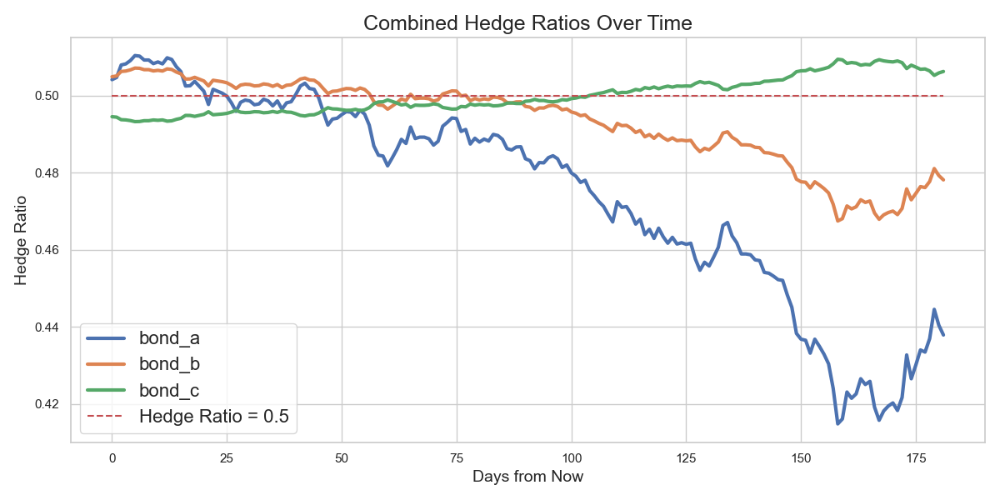

# Pension Fund Interest Rate Risk Hedging and Funding Analysis

This project is an analysis of the pension fund liabilities and bond metrics to hedge interest rate risks for PFFG, a pension fund. The assignment focuses on calculating the present value (PV) of the liabilities, determining the bond metrics (Price, DV01, Modified Duration), and analyzing how to hedge the interest rate risks of the pension fund.


## Index

- [Installation](#installation)
- [Analysis Information](#analysis-information)
- [1. Bond Metrics Comparison](#1-bond-metrics-comparison)
- [2. Hedge Ratios Over Time](#2-hedge-ratios-over-time)
- [3. Time to Full Funding vs. Additional Asset Growth Rate](#3-time-to-full-funding-vs-additional-asset-growth-rate)
- [4. Notional Values of Bonds vs. Present Value of Liabilities](#4-notional-values-of-bonds-vs-present-value-of-liabilities)
- [Conclusion](#conclusion)

## Installation
This application runs on Python 3.12. Other Python versions might work as well, but in such cases, you will need to update the pyproject.toml file and regenerate the poetry.lock file accordingly.

### Setting up the Poetry Environment

1. **Install Poetry**:  
   If you don't have Poetry installed, you can install it using the command:  
   ```
   curl -sSL https://install.python-poetry.org | python3 -
    ```
2.  **Update Python Version in pyproject.toml (if needed):**
    If you're using a different Python version than 3.12, you'll need to update the pyproject.toml file. Locate the [tool.poetry.dependencies] section and modify the Python version like this:
    ```
    python = "^3.x"
    ```
    and update the lock file:
    ```
    poetry lock --no-update
    ```
3. **Install Dependencies**:
    Navigate to the project directory (where pyproject.toml is located) and install the dependencies by running:
    ```
    poetry install
    ```
4. **Activate the Virtual Environment**:
    You can enter the virtual environment using:
    ```
    poetry shell
    ```
5. **Download data and save in data folder**:
    Save the cardano data in the folder with the name data/data_cardano.xlsx
    ```
    cd pensionfund
    mkdir data
    ```

6. **Run the Application**:
    Once inside the virtual environment, you can run the application by executing (on root level):
    ```
    python pensionfund/main.py
    ```
    Alternatively, for Python 3.10 or other versions, you can run commands directly using:
    ```
    poetry run python pensionfund/main.py
    ```

7. **Run Tests**:
    Working progress:
    ```
    cd pensionfund
    python -m unittest discover
    ```

## Bond information

-   Hedging analysis completed for bond_a with maturity 10 years and coupon 0.012
    Optimal notional: 6605714 for 50.0% hedge ratio
-   Hedging analysis completed for bond_b with maturity 20 years and coupon 0.015
   Optimal notional: 3497143 for 50.0% hedge ratio
-   Hedging analysis completed for bond_c with maturity 30 years and coupon 0.02
    Optimal notional: 2286593 for 50.0% hedge ratio

## Analysis Information
This analysis employs discrete compounding to calculate the Present Value (PV), DV01, and Modified Duration of the pension fund's liabilities and bond cash flows. Given that financial instruments like pension liabilities and bonds have annual cash flows/daily cash flows.

### Key Functions Used:

#### 1. `present_value()`
Calculates the Present Value (PV) of future cash flows using discrete compounding.

**Formula:**
$$ PV = \sum_{t=1}^n \frac{CF_t}{(1+r)^t} $$

Where:
- $(CF_t)$ = Cash flow at time $ t $
- $ r $ = Annual interest rate (as a decimal, e.g., 0.05 for 5%)
- $ t $ = Time period in years
- $ n $ = Total number of periods

#### 2. `dv01()`
Calculates the DV01 (Dollar Value of a Basis Point) using a central difference approximation. DV01 measures the change in present value for a 1 basis point (0.01%) change in the interest rate.

**Formula:**
$$ DV01 = \frac{PV(r - \Delta r) - PV(r + \Delta r)}{2} $$

Where:
- $ \Delta r $ = Change in interest rate (1 basis point = 0.0001)

**Explanation:**
Central Difference Approximation: By evaluating the PV at both $ r - \Delta r $ and $ r + \Delta r $, this method provides a more accurate estimation of the derivative $ \frac{dPV}{dr} $ than using a forward or backward difference.

#### 3. `modified_duration()`
Calculates the Modified Duration of the liabilities, measuring the sensitivity of the present value to changes in interest rates. This function utilizes the DV01 and the present value (PV) to compute the modified duration.

**Formula:**

$$ 
Modified\ Duration = \frac{DV01}{PV \times \Delta r} 
$$

Where:
- $( \Delta r )$ = Change in interest rate used in DV01 calculation (0.0001)

#### 5. `Hedging Ratio`
The hedging ratio is calculated using the sensitivity of liabilities to changes in a risk factor, relative to the sensitivity of the assets used to hedge those liabilities:
$$
\text{Hedging Ratio} = \frac{\text{Liability DV01}}{\text{Asset DV01}}
$$

#### 5. `Notional`
The notional amount required for the hedge is calculated using the following formula:
$$
\text{Notional} = \frac{\text{Hedge Percentage} \times \text{Liability DV01}}{\text{Bond DV01}}
$$


##### 6. `Full funding`

Assumption:
Liabilities are fixed over time, meaning they do not grow with interest or inflation.

Assets grow at a rate of $(1 + \text{Nominal Rate} + x)$. Liabilities remain constant.

###### Assets Growth:
$$
A_t = A_0 \times (1 + \text{Nominal Rate} + x)^t
$$

###### Liabilities Remain Constant:
$$
L_t = L_0
$$

###### Funding Ratio at Time $t$:
$$
\text{Funding Ratio}_t = \frac{A_t}{L_t} = \frac{A_0 \times (1 + \text{Nominal Rate} + x)^t}{L_0}
$$
$$
\text{Funding Ratio}_t = \text{Initial Funding Ratio} \times (1 + \text{Nominal Rate} + x)^t
$$

###### Solving for $t$ when Funding Ratio is 1 (full funding):
$$
1 = \text{Initial Funding Ratio} \times (1 + \text{Nominal Rate} + x)^t
$$
$$
(1 + \text{Nominal Rate} + x)^t = \frac{1}{\text{Initial Funding Ratio}}
$$
$$
t = \frac{\ln\left(\frac{1}{\text{Initial Funding Ratio}}\right)}{\ln(1 + \text{Nominal Rate} + x)}
$$


## 1. Bond Metrics Comparison


### Explanation:
This bar chart compares the key metrics for three government bonds (bond_a, bond_b, bond_c):s.
- **Modified Duration**: Shown in brown, this is a measure of how sensitive the bond price is to changes in interest rates. A higher modified duration means greater sensitivity. 
- **Modified Duration of Liabilities**: The red dashed line represents the modified duration of the pension fund's liabilities (24.30), which serves as a benchmark for comparing the bond durations.

### Insights:
Bond Selection Criteria: Since bond_b's duration closely matches the liabilities' duration, it suggests that bond_b would effectively hedge the interest rate risk, minimizing the mismatch between asset and liability sensitivities.


## 2. Hedge Ratios Over Time



### Explanation:
This line plot shows how the hedge ratios for each of the three bonds evolve over time (in days) as interest rates change.
- **Hedge Ratio**: This represents the proportion of the liability's interest rate exposure that is being hedged by each bond. A higher value indicates better coverage of the interest rate risk.
- **Bond_a**: The blue line fluctuates more significantly, indicating that bond_a is not very stable in maintaining a consistent hedge.
- **Bond_b**: The orange line shows more stability but experiences slight dips.
- **Bond_c**: The green line shows the most stable hedge ratio over time.

### Insights:
The stability of hedge ratios for bond_b and bond_c reinforces their potential as effective hedging instruments. However, considering the duration match and overall stability, bond_b remains the preferred choice for hedging PFFG’s interest rate risk.

## 3. Time to Full Funding vs. Additional Asset Growth Rate


### Explanation:
This plot shows the relationship between the additional growth rate of the assets and the time it will take to achieve full funding (a funding ratio of 100%).
- **Y-Axis**: Time to full funding in years.
- **X-Axis**: Additional growth rate of assets (in %).
- **Red Line**: Marks the point where the time to full funding is approximately 15 years, assuming no additional asset growth (growth rate = 0%).

### Insights:
- 0% Additional Growth: 15 years to full funding.
- 1% Additional Growth: Approximately 10 years.
- 5% Additional Growth: Around ~5 years.

Impact of Growth Rate: There's a clear inverse relationship between the additional asset growth rate and the time to full funding. Higher growth rates significantly reduce the time required to achieve full funding.
Strategic Implications: Encouraging higher asset growth rates can expedite the funding process, enhancing the pension fund's financial health and reducing long-term liabilities.

Connection Between Growth Rates and Bond Maturities:
- Longer-Maturity Bonds (bond_c): More sensitive to interest rate changes due to longer durations. They offer higher yields to compensate for the increased risk.
- Shorter-Maturity Bonds (bond_a): Less sensitive to interest rate changes, offering lower yields but higher price stability.

Impact on Asset Growth:
- Longer Maturities: Potentially higher returns if interest rates remain favorable, contributing more significantly to asset growth. However, they carry higher interest rate risk.
- Shorter Maturities: Provide more predictable returns with lower interest rate risk, but may contribute less to rapid asset growth compared to longer maturities.


## 4. Notional Values of Bonds vs. Present Value of Liabilities


### Explanation:
This bar chart compares the notional values of the bonds (in millions) with the present value (PV) of the pension fund's liabilities. The notional value is the face value or principal amount of the bond you need to purchase to achieve the desired level of hedging (e.g., 50% of the interest rate risk).
- **Bonds**: Each bond (a, b, c) is shown with its notional value in blue.
- **PV of Liabilities**: Represented by the red dashed line, the total present value of the pension fund's liabilities is approximately 7.2 million.


## Conclusion

In this analysis, an evaluation was conducted to hedge the interest rate risk associated with the pension fund liabilities of PFFG. Through a comparison of bond metrics, `bond_b` was identified as the optimal choice, given its modified duration closely aligns with that of the liabilities and it maintains a stable hedge ratio over time. The notional amount required to hedge 50% of the interest rate risk demonstrated how this hedge would perform over the next six months given changing interest rates. It gives a measure of desired time to rehedge. 

Furthermore, the funding ratio analysis highlighted the significant impact of additional asset growth on reducing the time to achieve full funding. It was found that even a modest increase in asset growth rates can decrease the time needed for the pension fund to reach full funding status.