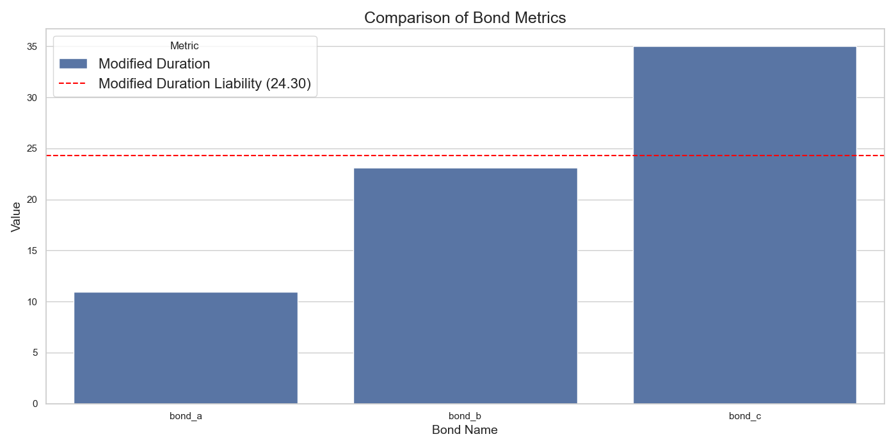

# Pension Fund Interest Rate Risk Hedging and Funding Analysis

This project is an analysis of the pension fund liabilities and bond metrics to hedge interest rate risks for PFFG, a pension fund. The assignment focuses on calculating the present value (PV) of the liabilities, determining the bond metrics (Price, DV01, Modified Duration), and analyzing how to hedge the interest rate risks of the pension fund.


## Index

- [Installation](#installation)
- [1. Bond Metrics Comparison](#1-bond-metrics-comparison)
- [2. Hedge Ratios Over Time](#2-hedge-ratios-over-time)
- [3. Time to Full Funding vs. Additional Asset Growth Rate](#3-time-to-full-funding-vs-additional-asset-growth-rate)
- [4. Notional Values of Bonds vs. Present Value of Liabilities](#4-notional-values-of-bonds-vs-present-value-of-liabilities)
- [Conclusion](#conclusion)

## Installation
### Setting up the Poetry Environment

1. **Install Poetry**:  
   If you don't have Poetry installed, you can install it using the command:  
   ```
   curl -sSL https://install.python-poetry.org | python3 -
    ```
2. **Install Dependencies**:
    Navigate to the project directory (where pyproject.toml is located) and install the dependencies by running:
    ```
    poetry install
    ```
3. **Activate the Virtual Environment**:
    You can enter the virtual environment using:
    ```
    poetry shell
    ```
4. **Download data and save in data folder**:
    Save the cardano data in the folder with the name data/data_cardano.xlsx
    ```
    cd pensionfund
    mkdir data
    ```

5. **Run the Application**:
    Once inside the virtual environment, you can run the application by executing (on root level):
    ```
    python pensionfund/main.py
    ```

## Bond information

-   Hedging analysis completed for bond_a with maturity 10 years and coupon 0.012
    Optimal notional: 6597497.83 for 50.0% hedge ratio
-   Hedging analysis completed for bond_b with maturity 20 years and coupon 0.015
   Optimal notional: 3492792.97 for 50.0% hedge ratio
-   Hedging analysis completed for bond_c with maturity 30 years and coupon 0.02
    Optimal notional: 2283749.25 for 50.0% hedge ratio

## 1. Bond Metrics Comparison



### Explanation:
This bar chart compares the key metrics for three government bonds (bond_a, bond_b, bond_c):s.
- **Modified Duration**: Shown in brown, this is a measure of how sensitive the bond price is to changes in interest rates. A higher modified duration means greater sensitivity. 
- **Modified Duration of Liabilities**: The red dashed line represents the modified duration of the pension fund's liabilities (16.46), which serves as a benchmark for comparing the bond durations.

### Insights:
Bond Selection Criteria: Since bond_b's duration closely matches the liabilities' duration, it suggests that bond_b would effectively hedge the interest rate risk, minimizing the mismatch between asset and liability sensitivities.


## 2. Hedge Ratios Over Time


### Explanation:
This line plot shows how the hedge ratios for each of the three bonds evolve over time (in days) as interest rates change.
- **Hedge Ratio**: This represents the proportion of the liability's interest rate exposure that is being hedged by each bond. A higher value indicates better coverage of the interest rate risk.
- **Bond_a**: The blue line fluctuates more significantly, indicating that bond_a is not very stable in maintaining a consistent hedge.
- **Bond_b**: The orange line shows more stability but experiences slight dips.
- **Bond_c**: The green line shows the most stable hedge ratio over time.

### Insights:
The stability of hedge ratios for bond_b and bond_c reinforces their potential as effective hedging instruments. However, considering the duration match and overall stability, bond_b remains the preferred choice for hedging PFFG’s interest rate risk.

## 3. Time to Full Funding vs. Additional Asset Growth Rate


### Explanation:
This plot shows the relationship between the additional growth rate of the assets and the time it will take to achieve full funding (a funding ratio of 100%).
- **Y-Axis**: Time to full funding in years.
- **X-Axis**: Additional growth rate of assets (in %).
- **Red Line**: Marks the point where the time to full funding is approximately 15 years, assuming no additional asset growth (growth rate = 0%).

### Insights:
- 0% Additional Growth: 15 years to full funding.
- 1% Additional Growth: Approximately 10 years.
- 5% Additional Growth: Around ~5 years.

Impact of Growth Rate: There's a clear inverse relationship between the additional asset growth rate and the time to full funding. Higher growth rates significantly reduce the time required to achieve full funding.
Strategic Implications: Encouraging higher asset growth rates can expedite the funding process, enhancing the pension fund's financial health and reducing long-term liabilities.

An inverse relationship means that as the additional asset growth rate increases, the time required to achieve full funding decreases. This makes intuitive sense for the following reasons:
1. Higher Growth Rates Accelerate Asset Accumulation:
    When assets grow faster, they accumulate more quickly, allowing the fund to reach the necessary level to cover liabilities sooner.
2. Compound Growth Effect:
    Higher growth rates benefit from compound interest, where the growth earned each year is reinvested to generate its own growth, exponentially increasing asset value over time.
3. Reduced Dependency on Time:
    With higher growth rates, the fund relies less on waiting for assets to grow passively, thus shortening the funding period.

Connection Between Growth Rates and Bond Maturities:
- Longer-Maturity Bonds (bond_c): More sensitive to interest rate changes due to longer durations. They offer higher yields to compensate for the increased risk.
- Shorter-Maturity Bonds (bond_a): Less sensitive to interest rate changes, offering lower yields but higher price stability.

Impact on Asset Growth:
- Longer Maturities: Potentially higher returns if interest rates remain favorable, contributing more significantly to asset growth. However, they carry higher interest rate risk, which must be managed carefully.
- Shorter Maturities: Provide more predictable returns with lower interest rate risk, but may contribute less to rapid asset growth compared to longer maturities.


## 4. Notional Values of Bonds vs. Present Value of Liabilities


### Explanation:
This bar chart compares the notional values of the bonds (in millions) with the present value (PV) of the pension fund's liabilities.
- **Bonds**: Each bond (a, b, c) is shown with its notional value in blue.
- **PV of Liabilities**: Represented by the red dashed line, the total present value of the pension fund's liabilities is approximately 7.2 million.

### Summary Bond Notional Values:
- bond_a: 6,597,498
- bond_b: 3,492,793
- bond_c: 2,283,749
- PV of Liabilities: 7,215,075.85


